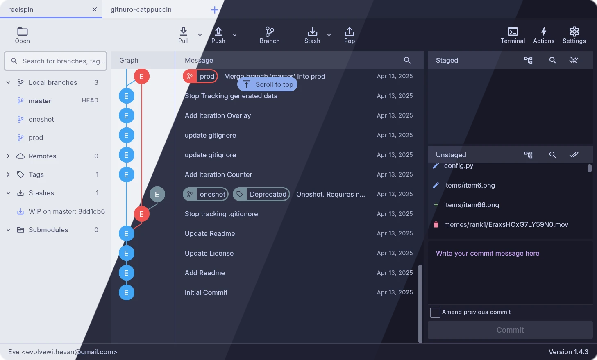
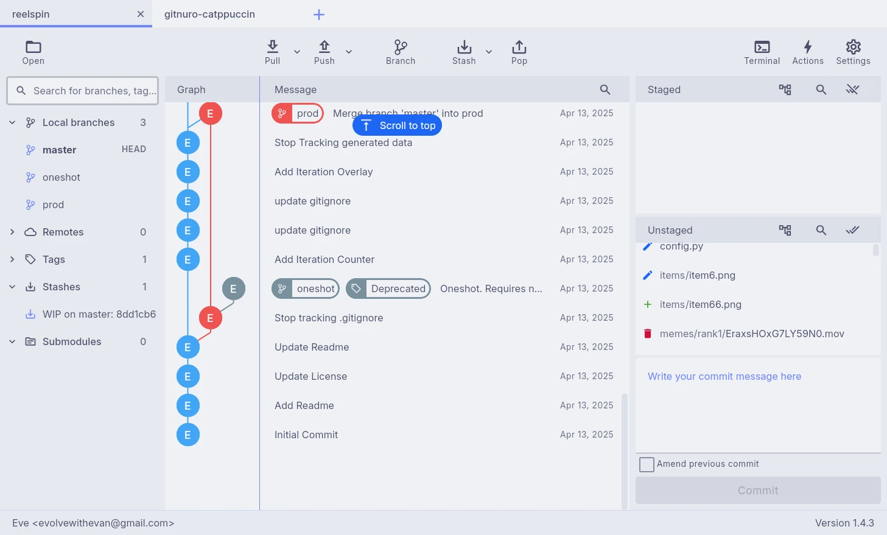
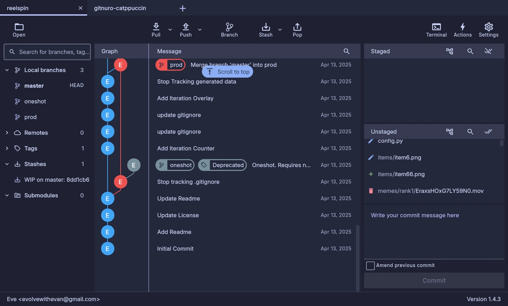
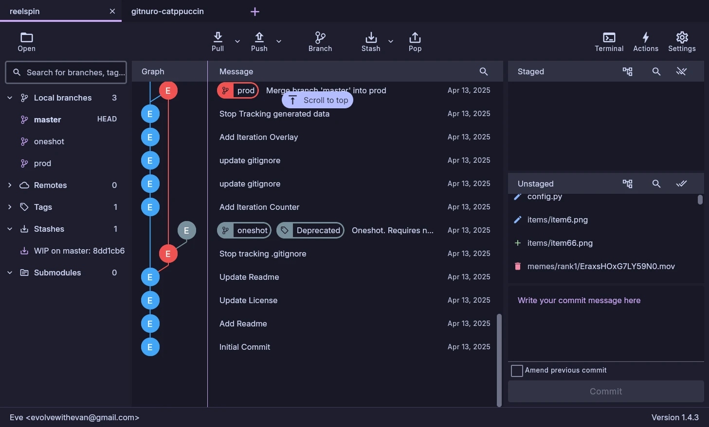

<h3 align="center">
	 
	
	Catppuccin for <a href="https://gitnuro.com/">Gitnuro</a>
	
</h3>

	
	
	

	

## Previews

🌻 Latte

🪴 Frappé

🌺 Macchiato

🌿 Mocha

## Usage

1. Download the flavor of your choice.
2. Open the app and go to **Settings** > **Appearance** > **Theme : Custom** > **Open file**.
3. Select the downloaded flavor file.

<!-- The FAQ section is optional. Remove if needed.-->
## 🙋 FAQ

- Q: **_"I dont see any `Open file` button, where is it"_**\
  A: You must set the Theme to custom before you will see the `Open file` button

- Q: **_"What am I supposed to download to make this work?"_**\
  A: Download any of the `.json` files associated with the theme(s) that you would like to install

- Q: **_"Why are the the graph colors not in theme?"_**\
  A: Unfortunately this is a limitation of the current version of Gitnuro's theming implementation. I would love to include in-theme commit graphing. 

## 💝 Thanks to

- [Evelyn](https://github.com/evolvewithevan)

&nbsp;

	

	Copyright &copy; 2021-present <a href="https://github.com/catppuccin" target="_blank">Catppuccin Org</a>

	

